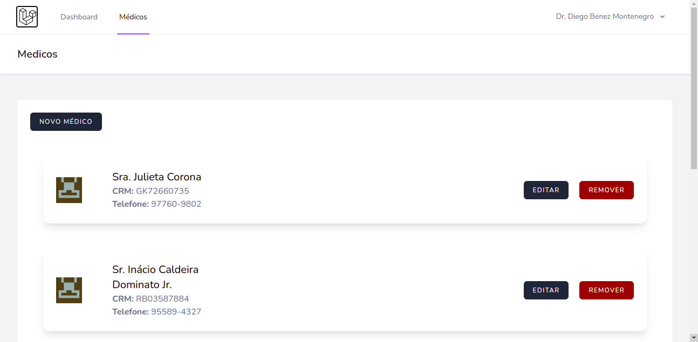

## Requisitos básicos
* Docker >= 20.10.12
* Docker-Compose >= 1.26.0
## Instalação
Será utilizado o Docker para montar um container temporário, utilizando PHP 8.1, para poder rodar a instalação das dependências com o composer e ter o projeto completamente instalado.
```
$ docker run --rm \
    -u "$(id -u):$(id -g)" \
    -v $(pwd):/var/www/html \
    -w /var/www/html \
    laravelsail/php81-composer:latest \
    composer install --ignore-platform-reqs
```
Após essa etapa, o comando `./vendor/bin/sail` estará disponível. O sail é um wrapper do Laravel ao redor do docker-compose que oferece atalhos para comandos frequentes dentro do container. 
[Verifique a documentação do sail no laravel 9](https://laravel.com/docs/9.x/sail)

Em seguida, copie o arquivo .env.example como .env

```
$ cp .env.example .env
```

Preencha as variáveis WWWUSER e WWWGROUP com o respectivos valores de uid e gid do retorno do comando id 

```
$ id
uid=1000(user) gid=1000(user)

// .env
WWWUSER=1000
WWWGROUP=1000
```

Preencha os valores desejados para as configurações de banco de dados, mas lembre-se de informar 'mysql' para a variável DB_HOST. O docker irá substituir automaticamente pelo endereço do servidor

```
DB_CONNECTION=mysql
DB_HOST=mysql /** nome do serviço no docker-compose.yml */
DB_PORT=
DB_DATABASE=
DB_USERNAME=
DB_PASSWORD=
```

Gere uma chave criptográfica para a aplicação, obrigatório no Laravel

```
$ sail artisan key:generate --ansi
```

Em seguida, inicie o container principal do projeto para iniciar a configuração do projeto.
```
$ sail up -d
$ sail bash
sail@user:/var/www/html$ npm i
sail@user:/var/www/html$ npm run dev
sail@user:/var/www/html$ php artisan migrate --seed
```
Então acessar http://localhost

## Exemplo da tela de listagem de médicos
